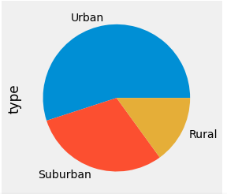
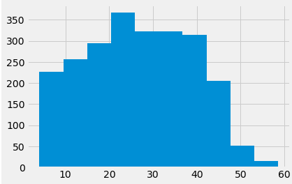
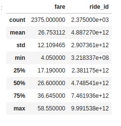
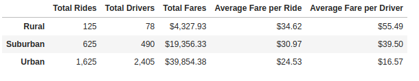
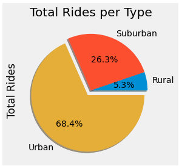

# PyBer_Analysis
## Background

An exploratory analysis of rideshare data using Pandas libraries, and Matplotlib to visualize data.

## Overview of the Analysis

The purpose of this project is to perform an exploratory analysis in some very large csv files and create several types of visualization to construct  a compelling story about the data. The objective is to produce an analysis and visualizations that will help our client to improve access to ride-sharing services and determine affordability for underserved neighborhoods.

### Customer's guidance:
- Using your Python skills and knowledge of Pandas, you’ll create a summary DataFrame of the ride-sharing data by city type. 
- Then, using Pandas and Matplotlib, you’ll create a multiple-line graph that shows the total weekly fares for each city type.
- Create a written report that summarizes how the data differs by city type and how those differences can be used by decision-makers at PyBer.

 
  

## Analysis
### Exploratory analysis
As part of our exploratory analysis we created some basic charts to visualize our data and obtain a better understanding of our dataset. First we created a pie chart Fig 1.1, by analyzing this image we can see that there were 3 city types: **Urban, Suburban, Rural**

 

Figure 1.1 Pie chart by city type.

 

Additionally, we created a histogram (Figure 1.2)  of fares to better understand the fares per type and used .describe() method to obtain some statistical data about the fares per type. (Figure 1.3)

Figure 1.2 Histogram fares.

 

 Figure 1.3 Statistical data

 

### Results

 

After our analysis we were able to created a PyBer summary DataFrame that summarized: The total number of rides for each city type, The total number of drivers for each city type, The sum of the fares for each city type is retrieved, ​The average fare per ride for each city type is calculated, The average fare per driver for each city type is calculated as shown in (Figure 1.4).

Figure 1.4 Total Rides summary table

and with this data we created a pie chart of the total rides per type. (Figure 1.5)

 

 Fiure 1.5 Pie chart -Total rides per type

 

#### Observations of Summary Table
- Urban cities have a higher total rate of rides per driver than suburban and rural areas. Total rides in the Urban areas represent **68.4%** of all the rides vs **26.3%** in Suburban and **5.3%** in Rural areas.
- There are many more drivers in Urban areas with a total of **2,405** vs **490** in Suburban and **78** in Rural areas, **96.76%** more drivers in Urban areas.
- Total fares for urban areas was **$39,854.38** vs **$4,327.93** for rural areas. This is **89.14%** more than Rural areas.
- Average fares per ride are more expensive in Rural areas with **$34.62** per ride vs **$24.53**  in Urban areas, **29.15%** more expensive in Rural areas.
- Average fare per driver is more expensive in Rural areas with **$55.49** vs **$39.50** in Suburban areas and **$16.50** in Urban areas,  **70.26%** more expensive in Rural areas.

 

Finally we created a visualization of the "Total Fare by City Type" using a multi-line plot as shown in Figure 1.6.

 

Figure 1.6 Multiline chart

 

## Summary

As we can observe in our analysis the Urban market is more profitable for the company as the market is bigger in Urban areas. This can be seen in Figure 1.5, the Urban market represents 68.2% of the total rides. There is also many more drivers in Urban cities vs suburban and rural areas. this allows them to offer better rates and be more profitable per volume. 
If we look at Fig. 1.5, we notice that there is a disparity in the market among the city types. In an effort to reduce the disparity in the market the client could do the following:

- Improve marketing in rural areas to increase the demand for the service.
- Increase the number of drivers in rural and suburban areas.
- Offer better the average fare price per driver.

These changes will allow the client to offer more competitive and appealing prices in suburban and rural areas; increasing the demand for the service and improving the accessibility in those areas resulting in a better distributed market.

 

## References

[Markdown](https://docs.github.com/en/get-started/writing-on-github/getting-started-with-writing-and-formatting-on-github/basic-writing-and-formatting-syntax)

[Matplotlib gallery](https://matplotlib.org/stable/plot_types/stats/pie.html#sphx-glr-plot-types-stats-pie-py)
