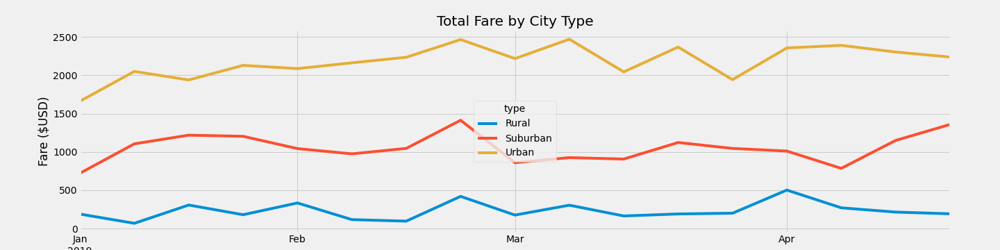

# PyBer_Analysis
An exploratory analysis of rideshare data using Pandas libraries, and Matplotlib to visualize data.

## Background

Customer's guidance:
- Using your Python skills and knowledge of Pandas, you’ll create a summary DataFrame of the ride-sharing data by city type. 
- Then, using Pandas and Matplotlib, you’ll create a multiple-line graph that shows the total weekly fares for each city type.
- Create a written report that summarizes how the data differs by city type and how those differences can be used by decision-makers at PyBer.
 
## Overview of the Analysis

As part of our exploratory analysis we created some basic charts to obtain a better understanding of our data set. First we created a pie chart Fig 1.1, by analising this image we can see that there were 3 types: **Urban, Suburban, Rural**

 

Figure 1.1 Pie chart by city type.

 

Aditionally, we created a histogram of fares

<su>Figure 1.2 Histogram fares.

 

Total Rides smmary table

Figure 1.3 Total Rides summary table

 Fiure 1.4 Total rides per type

 

### Results

Multiline chart

#### Observations of Summary Table

## Summary

## References

[Markdown](https://docs.github.com/en/get-started/writing-on-github/getting-started-with-writing-and-formatting-on-github/basic-writing-and-formatting-syntax)

[Matplot gallery](https://matplotlib.org/stable/plot_types/stats/pie.html#sphx-glr-plot-types-stats-pie-py)